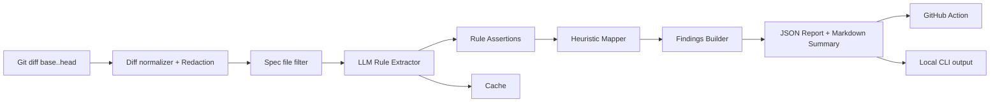

<div align="center">
  
  
  
</div>

<h1>🚦 SpecGuard LLM</h1>

<p align="center">
  <b>LLM-powered <span style="color:#7c3aed">spec drift</span> &amp; <span style="color:#059669">compliance checker</span> for Ethereum specs/clients</b><br/>
  <sub>Automated, explainable, and secure protocol review for the Ethereum ecosystem</sub>
</p>

<hr/>

<details open>
<summary><b>🔗 Table of Contents</b></summary>

- <a href="#-overview">Overview</a>
- <a href="#-quick-start">Quick Start</a>
- <a href="#architecture">Architecture</a>
- <a href="#-cli-usage">CLI Usage</a>
- <a href="#-github-action">GitHub Action</a>
- <a href="#-advanced">Advanced</a>
- <a href="#-examples">Examples</a>
- <a href="#-demo">Demo (CI + PR)</a>
- <a href="#-prompts">Prompts</a>
- <a href="#-license">License</a>
</details>

<hr/>

<h2 id="-overview">✨ Overview</h2>

<p>
  <b>SpecGuard LLM</b> is an LLM-assisted spec drift &amp; compliance checker for Ethereum specs/clients.
  It runs in CI on pull requests, analyzes the diff, extracts affected protocol rules, maps them to impacted code/tests,
  and posts structured findings back to GitHub PRs.
</p>

<p><b>What makes this a fit for Ethereum protocol security workflows?</b></p>
<ul>
  <li><b>Deployable system (not research-only):</b> runs locally and in CI (GitHub PR checks) with reproducible artifacts.</li>
  <li><b>Spec ingestion &amp; parsing:</b> consumes evolving spec material (markdown / pseudocode / curated extracts) from Ethereum protocol repos.</li>
  <li><b>Code–spec comparison:</b> flags mismatches and drift by linking spec rules to impacted implementation areas and tests.</li>
  <li><b>Actionable outputs:</b> severity-tagged findings + evidence pointers + suggested next steps (PR comment + JSON report).</li>
  <li><b>Security &amp; reproducibility:</b> diff redaction, deterministic mode, cache, and versioned prompt packs.</li>
</ul>

<p><b>Why SpecGuard?</b></p>
<ul>
  <li>Protocol spec changes are often subtle and critical.</li>
  <li>Turns every PR into a smart review checklist:
    <ul>
      <li>What rules changed?</li>
      <li>Where should code/tests reflect them?</li>
      <li>What's missing or inconsistent?</li>
    </ul>
  </li>
</ul>

<hr/>

<h2 id="-quick-start">🚀 Quick Start</h2>

<pre><code class="language-bash">git clone https://github.com/GitBodda/specguard-llm
cd specguard-llm
pip install -e ".[dev]"</code></pre>

<p>Analyze a spec repo (example: consensus-specs):</p>
<pre><code class="language-bash">git clone https://github.com/ethereum/consensus-specs
cd consensus-specs
specguard analyze --repo . --base origin/master --head HEAD --out specguard.json</code></pre>

<p>Summarize findings:</p>
<pre><code class="language-bash">specguard summarize --input specguard.json</code></pre>

<hr/>

---

<a id="architecture"></a>
## 🏗️ Architecture


---

<h2 id="-cli-usage">⚡ CLI Usage</h2>

<p>Analyze changes:</p>
<pre><code class="language-bash">specguard analyze --repo . --base origin/master --head HEAD --out specguard.json</code></pre>

<p>Enable LLM (OpenAI):</p>
<pre><code class="language-bash">export SPEC_GUARD_LLM_PROVIDER=openai
export SPEC_GUARD_OPENAI_BASE_URL=https://api.openai.com/v1
export SPEC_GUARD_OPENAI_API_KEY=...
export SPEC_GUARD_OPENAI_MODEL=gpt-4o-mini</code></pre>

<p>Deterministic mode:</p>
<pre><code class="language-bash">specguard analyze --deterministic --cache-dir .specguard/cache</code></pre>

<hr/>

<h2 id="-github-action">🔄 GitHub Action</h2>

<p>Add to your repo as <code>.github/workflows/specguard.yml</code>:</p>

<pre><code class="language-yaml">name: SpecGuard
on:
  pull_request:
    types: [opened, synchronize, reopened]
permissions:
  contents: read
  pull-requests: write
jobs:
  specguard:
    runs-on: ubuntu-latest
    steps:
      - uses: actions/checkout@v4
        with:
          fetch-depth: 0
      - uses: actions/setup-python@v5
        with:
          python-version: "3.11"
      - name: Install SpecGuard
        run: |
          pip install specguard
      - name: Run SpecGuard
        env:
          GITHUB_TOKEN: ${{ secrets.GITHUB_TOKEN }}
          SPEC_GUARD_LLM_PROVIDER: openai
          SPEC_GUARD_OPENAI_API_KEY: ${{ secrets.OPENAI_API_KEY }}
          SPEC_GUARD_OPENAI_MODEL: gpt-4o-mini
          SPEC_GUARD_OPENAI_BASE_URL: https://api.openai.com/v1
        run: |
          specguard github-action \
            --repo . \
            --base "${{ github.event.pull_request.base.sha }}" \
            --head "${{ github.event.pull_request.head.sha }}" \
            --pr-number "${{ github.event.pull_request.number }}" \
            --repo-slug "${{ github.repository }}" \
            --fail-on high \
            --out specguard.json
      - name: Upload SpecGuard artifact
        uses: actions/upload-artifact@v4
        with:
          name: specguard-report
          path: specguard.json</code></pre>

<blockquote>
  CI fails only for HIGH severity findings (<code>--fail-on high</code>). The PR comment and JSON artifact remain available for review.
</blockquote>

<hr/>

<h2 id="-advanced">🧭 Advanced</h2>

<p><b>Multi-repo mapping:</b> Map spec rules into a client repo to highlight where updates/tests are needed.</p>
<pre><code class="language-bash">cd consensus-specs
export CLIENT_REPO=/path/to/lighthouse
specguard analyze \
  --repo . \
  --base origin/master \
  --head HEAD \
  --map-repo "$CLIENT_REPO" \
  --repo-slug ethereum/consensus-specs \
  --search-backend auto \
  --deterministic \
  --cache-dir .specguard/cache \
  --out specguard.json</code></pre>

<p><b>Config file example (<code>specguard.yml</code>):</b></p>
<pre><code class="language-yaml">repo_slug: ethereum/consensus-specs
map_repo: /path/to/client
extra_redact:
  - "(?i)INFURA_[A-Z0-9_]{10,}"
search_backend: auto
max_keyword_hits: 60
prefer_tests: true
max_findings: 200</code></pre>

<hr/>

<h2 id="-examples">📂 Examples</h2>

<p>See <a href="examples/">examples/</a>:</p>
<ul>
  <li><a href="examples/sample_report.json">examples/sample_report.json</a></li>
  <li><a href="examples/sample_comment.md">examples/sample_comment.md</a> (example PR comment format)</li>
</ul>

<hr/>

<a id="-demo"></a>
<h2>🛠️ Demo (CI + PR)</h2>

<p>
  As supporting evidence of a working prototype and CI integration, this repo includes the following demo assets.
  (These are intentionally kept the same paths so existing screenshots/links remain stable.)
</p>

<h3>Pull Request Comment (MEDIUM severity finding)</h3>
<p></p>

<h3>GitHub Actions – Successful CI Run</h3>
<p></p>

<h3>Structured Output (specguard.json)</h3>
<p></p>

<hr/>

<a id="-prompts"></a>
<h2>💡 Prompts</h2>

<p>All prompts are versioned and editable under <a href="prompts/">prompts/</a>:</p>
<ul>
  <li><a href="prompts/rule_extraction.md">prompts/rule_extraction.md</a></li>
  <li><a href="prompts/severity_scoring.md">prompts/severity_scoring.md</a></li>
</ul>

<p>Prompt pack structure:</p>
<pre><code>prompts/
  pack.yaml
  rule_extraction.md
  severity_scoring.md</code></pre>

<hr/>

<h2 id="-license">📄 License</h2>

<p>MIT</p>
```0
