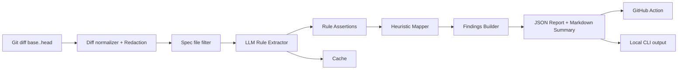
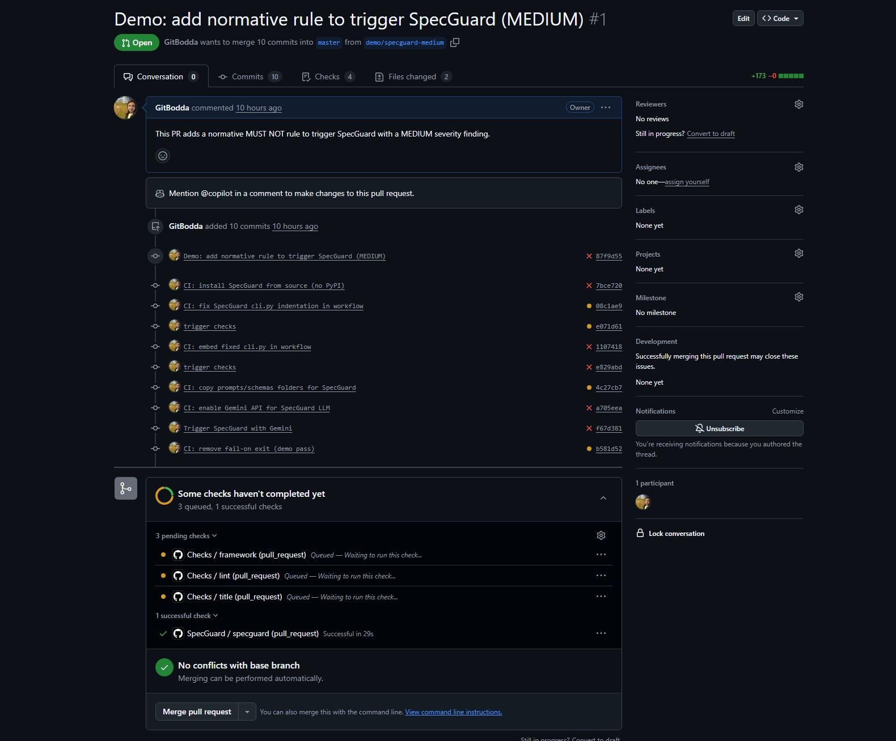
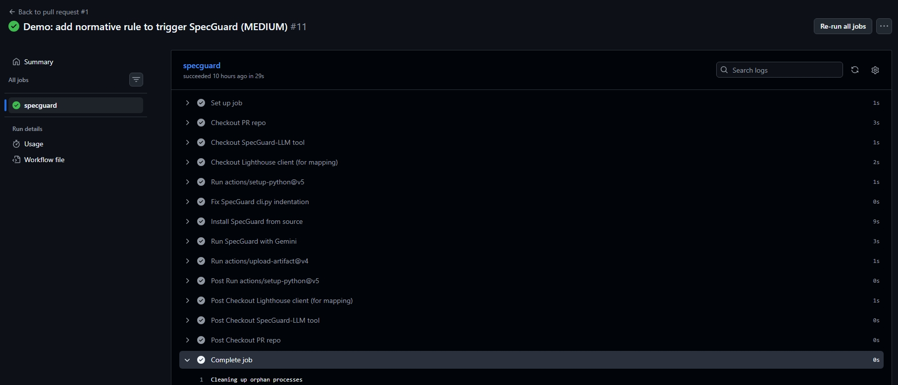
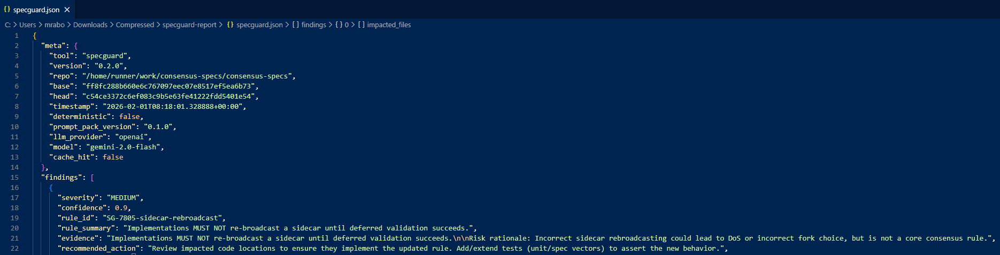

<div align="center">
  
  
  
</div>

# 🚦 SpecGuard LLM

<p align="center">
  <b>LLM-powered <span style="color:#7c3aed">spec drift</span> & <span style="color:#059669">compliance checker</span> for Ethereum specs/clients</b><br>
  <sub>Automated, explainable, and secure protocol review for the Ethereum ecosystem</sub>
</p>

---

<details open>
<summary><b>🔗 Table of Contents</b></summary>

- [Overview](#-overview)
- [Quick Start](#-quick-start)
- [Architecture](#architecture)
- [CLI Usage](#-cli-usage)
- [GitHub Action](#-github-action)
- [Advanced](#-advanced)
- [Examples](#-examples)
- [Demo (CI + PR)](#-demo-ci--pr)
- [Prompts](#-promopts)
- [License](#-license)
</details>

---

## ✨ Overview

**SpecGuard LLM** is an LLM-assisted spec drift & compliance checker for Ethereum specs/clients. It runs in CI on pull requests, analyzes the diff, extracts affected protocol rules, maps them to impacted code/tests, and posts structured findings back to GitHub PRs.

**Why SpecGuard?**
- Protocol spec changes are often subtle and critical.
- Turns every PR into a smart review checklist:
  - What rules changed?
  - Where should code/tests reflect them?
  - What's missing or inconsistent?

---

## 🚀 Quick Start


```bash
git clone https://github.com/GitBodda/specguard-llm
cd specguard-llm
pip install -e ".[dev]"
```

Analyze a spec repo (example: consensus-specs):

```bash
git clone https://github.com/ethereum/consensus-specs
cd consensus-specs
specguard analyze --repo . --base origin/master --head HEAD --out specguard.json
```

Summarize findings:

```bash
specguard summarize --input specguard.json
```

---
<a id="architecture"></a>
## 🏗️ Architecture



---

## ⚡ CLI Usage

Analyze changes:

```bash
specguard analyze --repo . --base origin/master --head HEAD --out specguard.json
```

Enable LLM (OpenAI):

```bash
export SPEC_GUARD_LLM_PROVIDER=openai
export SPEC_GUARD_OPENAI_BASE_URL=https://api.openai.com/v1
export SPEC_GUARD_OPENAI_API_KEY=...
export SPEC_GUARD_OPENAI_MODEL=gpt-4o-mini
```

Deterministic mode:

```bash
specguard analyze --deterministic --cache-dir .specguard/cache
```

---

## 🔄 GitHub Action

Add to your repo as `.github/workflows/specguard.yml`:

```yaml
name: SpecGuard
on:
  pull_request:
    types: [opened, synchronize, reopened]
permissions:
  contents: read
  pull-requests: write
jobs:
  specguard:
    runs-on: ubuntu-latest
    steps:
      - uses: actions/checkout@v4
        with:
          fetch-depth: 0
      - uses: actions/setup-python@v5
        with:
          python-version: "3.11"
      - name: Install SpecGuard
        run: |
          pip install specguard
      - name: Run SpecGuard
        env:
          GITHUB_TOKEN: ${{ secrets.GITHUB_TOKEN }}
          SPEC_GUARD_LLM_PROVIDER: openai
          SPEC_GUARD_OPENAI_API_KEY: ${{ secrets.OPENAI_API_KEY }}
          SPEC_GUARD_OPENAI_MODEL: gpt-4o-mini
          SPEC_GUARD_OPENAI_BASE_URL: https://api.openai.com/v1
        run: |
          specguard github-action \
            --repo . \
            --base "${{ github.event.pull_request.base.sha }}" \
            --head "${{ github.event.pull_request.head.sha }}" \
            --pr-number "${{ github.event.pull_request.number }}" \
            --repo-slug "${{ github.repository }}" \
            --fail-on high \
            --out specguard.json
      - name: Upload SpecGuard artifact
        uses: actions/upload-artifact@v4
        with:
          name: specguard-report
          path: specguard.json
```

> CI fails only for HIGH severity findings (`--fail-on high`).

---

## 🧭 Advanced

**Multi-repo mapping:** Map spec rules into a client repo to highlight where updates/tests are needed.

```bash
cd consensus-specs
export CLIENT_REPO=/path/to/lighthouse
specguard analyze \
  --repo . \
  --base origin/master \
  --head HEAD \
  --map-repo "$CLIENT_REPO" \
  --repo-slug ethereum/consensus-specs \
  --search-backend auto \
  --deterministic \
  --cache-dir .specguard/cache \
  --out specguard.json
```

**Config file example (`specguard.yml`):**

```yaml
repo_slug: ethereum/consensus-specs
map_repo: /path/to/client
extra_redact:
  - "(?i)INFURA_[A-Z0-9_]{10,}"
search_backend: auto
max_keyword_hits: 60
prefer_tests: true
max_findings: 200
```

---

## 📂 Examples


See [`examples/`](examples/):
- [`examples/sample_report.json`](examples/sample_report.json)
- [`examples/sample_comment.md`](examples/sample_comment.md)

---
<a id="demo"></a>
## 🛠️ Demo
SpecGuard in Action (CI + PR)
### Pull Request Comment (MEDIUM severity finding)


### GitHub Actions – Successful CI Run


### Structured Output (specguard.json)


---
<a id="prompts"></a>
## 💡 Prompts

All prompts are versioned and editable under [`prompts/`](prompts/):
- [`prompts/rule_extraction.md`](prompts/rule_extraction.md)
- [`prompts/severity_scoring.md`](prompts/severity_scoring.md)

Prompt pack structure:
```
prompts/
  pack.yaml
  rule_extraction.md
  severity_scoring.md
```

---

## 📄 License

MIT
